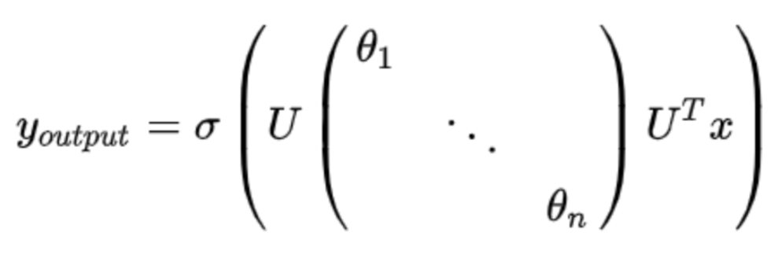
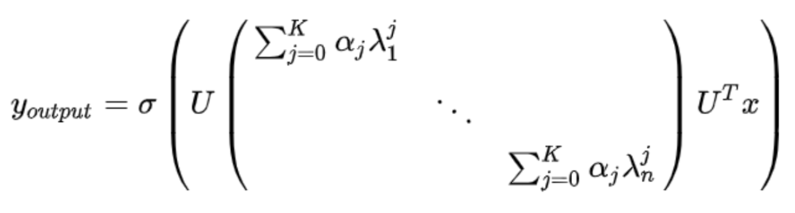

### GCN的原理
* Graph上的拉普拉斯矩阵L：
$$L = D - A$$ 其中D是度矩阵，A是邻接矩阵
对L进行对称归一化：
$$L = I - D^{-1/2} A D^{-1/2} $$ 拉普拉斯矩阵具有良好的性质，它是**对称半正定**的，特征分解可以写成：
$$L = U \Lambda U^T$$ 其中$U$为正交阵，即$UU^T = I$。
* GCN源于传统的傅里叶变换：
$$F(w) = \mathcal{F}[f(t)] = \int f(t)e^{-jwt}dt$$ 其中$e^{-jwt}$是傅里叶变换的基函数，它是拉普拉斯算子$\Delta$的特征函数，其中w与特征值有关。
拉普拉斯算子$\Delta$与$e^{-jwt}$满足特征方程：
$$\Delta e^{-jwt} = \frac{\partial^2 e^{-jwt}}{\partial t^2} = -w^2 e^{-jwt}$$
* 对应到Graph上的傅里叶变换：
$$F(\lambda_l) = \hat{f}(\lambda_l) = \sum\limits_{i=1}^{n} f(i)u_l(i)$$ 这里$u_l(i)$对应传统傅里叶变换中的基函数，$u_l(i)$在这为拉普拉斯矩阵的特征向量矩阵$U$的各个分量，具体为第$l$个特征向量的第$i$个分量。写成矩阵形式：
$$\left[ \begin{matrix} \hat{f}(\lambda_1)\\ \hat{f}(\lambda_2)\\ \vdots \\ \hat{f}(\lambda_n) \end{matrix} \right] = \left[ \begin{matrix} u_1(1) & u_1(2) & \cdots & u_1(n)\\ u_2(1) & u_2(2) & \cdots & u_2(n)\\ \vdots \\ u_n(1) & u_n(2) & \cdots & u_n(n) \end{matrix} \right] = \left[ \begin{matrix} f(\lambda_1)\\ f(\lambda_2)\\ \vdots \\ f(\lambda_n) \end{matrix} \right]$$ 改写为矩阵形式，$U^T$即为拉普拉斯矩阵分解后的特征向量矩阵的转置：
$$\hat{f} = U^T f$$ 对应的逆变换：
$$f = U \hat{f}$$
* **图卷积**
* 传统卷积: (卷积的傅里叶变换等于傅里叶变换的乘积)
$$\mathcal{F}[f*h] = \hat{f} \cdot \hat{h}$$    变换形式：
$$f*h = \mathcal{F}^{-1} [\hat{f} \cdot \hat{h}]$$
* 传统卷积推广到Graph上：
设$f$为待卷积函数，$h$为卷积核，即滤波器，
$$f*h = U \left[ \begin{matrix} \hat{h}_1\\ & \hat{h}_2 \\ & & \ddots\\ & & & \hat{h}_n \end{matrix} \right] U^T f$$ **这个滤波器的傅里叶变换 $\hat{h}_i$ 也就是我们要设计的部分！**
把上面矩阵写成符号表示：
$$f * h = U [(U^T h) \odot (U^T f)]$$

### GCN的发展
* 第一代GCN：
卷积核：
$$diag(\hat{h}(\lambda_l)) = diag(\theta_l)$$

* 第二代GCN：
卷积核：
$$\hat{h}(\lambda_l) = \sum\limits_{j=0}^{K}\alpha_j \lambda_l^j $$

