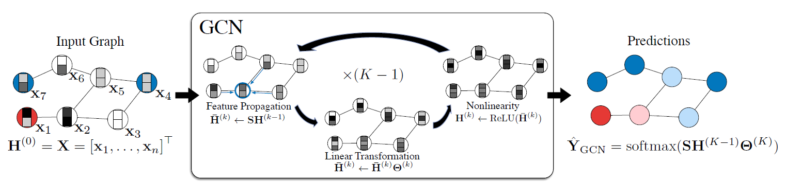
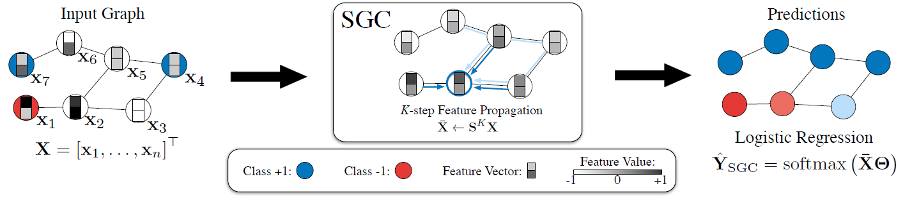

### GCN

GCN原理图

给定一个图，$G = (V, A)$，V是顶点集，A是邻接矩阵（对称阵）。用D表示图G的度矩阵，$D=diag(d_1,\cdots,d_n)$。用$H^{(i)}$表示图卷积中的结点特征。
输入的结点特征矩阵：
$$X = \{x_1^T,x_2^T,\cdots,x_n^T\}^T \in \mathbb{R}^{n \times d}$$
初始特征:$$H^{(0)} = X$$
图卷积包括三个步骤：特征传播、线性变换、非线性激活。
##### 特征传播：
给初始的邻接矩阵 A 添加自环(self-loops):
$$\tilde{A} = A + I$$ 用 $\tilde{D}$ 表示 $\tilde{A}$ 的度矩阵。
定义归一化的邻接矩阵：
$$S = \tilde{D}^{-\frac{1}{2}} \tilde{A} \tilde{D}^{-\frac{1}{2}}$$ 这个S在所有层都是一样的，直接通过$\tilde{A}$即可求得。
第k层的特征传播：
$$\tilde{H}^{(k)} \leftarrow SH^{(k-1)}$$
分开写：
$$\tilde{h}^{k}_{i} \leftarrow \frac{1}{d_i+1}h_i^{(k-1)} + \sum\limits_{j=1}^{n} \frac{a_{ij}}{\sqrt{(d_i+1)(d_j+1)}} h_j^{(k-1)}$$
##### 特征变换 + 非线性激活：
每一层有个权值矩阵$\theta^{(k)}$
$$H^{(k)} \leftarrow ReLU(\tilde{H^{(k)}} \theta^{(k)})$$
##### 分类器：
$$Y_{GCN} = softmax(SH^{(k-1)} \theta^{(k)})$$

### Simple Graph Convolution
它认为图卷积GCN和多层感知机MLP类似，只不过每一层当中对特征按照其近邻进行了平均化。这篇文章认为图卷积受目前普通卷积神经网络的影响，一开始就加入了非线性变换，还把网络层数搞得很深，于是他们把图卷积进行了简化，去掉了非线性激活，把图卷积网络改成了一个逻辑回归，在某些数据上表现不错。

Simple-GCN原理图

##### 图卷积的线性化：
$$Y = softmax(S\dots SSX \theta^{(1)}\dots \theta^{(k)})$$ 所有的S都是一样的，可以用$S^K$表示。然后后面的所有变换矩阵乘起来变成了一个矩阵$\theta = \theta^{(1)}\dots \theta^{(k)}$。
然后就变成了一个多分类的逻辑回归：
$$Y = softmax(S^K X \theta)$$
$S^K$可以在预处理阶段就可完成，因为需要用到的东西都是已知的。这样，
$$\tilde{X} = S^K X$$ 然后$softmax(\tilde{X} \theta)$就变成了单纯的多分类逻辑回归。优化可以直接利用逻辑回归的优化方法，如随机梯度下降（SGD）等。

#### 更多细节：
##### 一阶切比雪夫滤波器加入自环：
GCN中初始的first-order Chebyshev filter是：$S_{1-order} = I + D^{-1/2}AD^{-1/2}$，归一化的拉普拉斯矩阵：$\Delta_{sym} = I - D^{-1/2}AD^{-1/2}$，所以一阶切比雪夫滤波器变成：$S_{1-order} = 2I - \Delta_{sym}$。然后对于$S^K_{1-order}$，滤波系数是$g_i = (2 - \lambda_i)^K$,当$\lambda < 1$时随着K增加系数爆炸式增长，不好！
然后采用了【再归一化】，$S = \tilde{D}^{-1/2}\tilde{A}\tilde{D}^{-1/2}$,A和D分别是加了自环(self-loops)后的邻接矩阵和度矩阵，然后现在的拉普拉斯矩阵就变成了$\tilde{D}_{sym} = I - \tilde{D}^{-1/2}\tilde{A}\tilde{D}^{-1/2}$，滤波器系数变为$g_i = (1 - \tilde{\lambda}_i)^K$,性能变好了！

